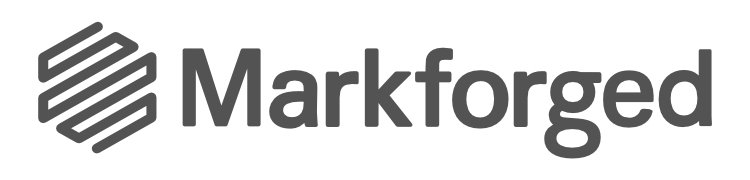
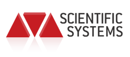
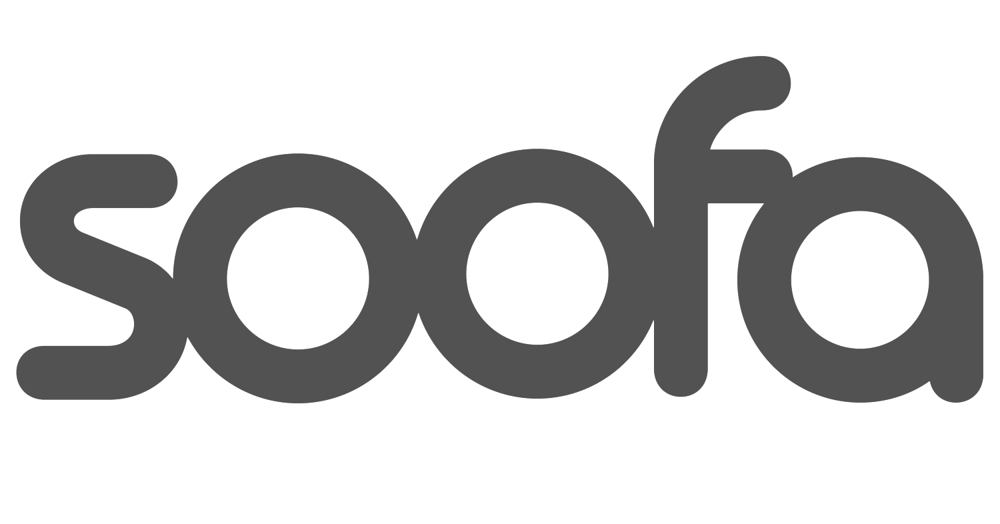

## About
My name is Silas Hughes, and I am an Engineer, a Roboticist, and an UAV Pilot.

I am a consultant working with companies in the Boston area, helping teams design, prototype, build, and test their robotic systems.

LOGOS:
- Markforged
- SSCI
- Soofa
- PRS
- CyPhy
- Olin

I received my B.S. in Mechanical Engineering from Olin College of Engineering. I continue to assist with robotics research conducted at Olin.

## Projects

## When
- Currently
 - Robotics and Design Consulting
 - Rapid Mechanical and Electrical Prototyping
 - UAV Pilot
 - Application Engineering
 - Clients
    - Markforged
    - SSCI
    - Soofa
    - PRS
    - CyPhy
- From June 2014 to ___ I led the mechanical design and manufacturing automation at Rest Devices. I built multiple automated assembly machines and test rigs used to manufacture our textiles, plastics, and electronics. I also built a set of tools to visualize our supply chain ecosystem and product inventory.

- During the summer of 2012, I designed and built multiple components for CyPhy Works' EASE, a small hovering robot designed for infrastructure inspection and surveillance.

- During the summer of 2014, I spent a week with Ocean Alliance and Sea Shepard out in the Gulf of Mexico tracking whales and trying to collect their blow with a drone, SnotBot, I developed while at Olin.

- Ariens SCOPE Project

-

## Where

IMAGES

  

    <figure class="image">
      
    </figure>
  

  

    <figure class="image">
      
    </figure>
  

  

    <figure class="image">
      
    </figure>
  

  

    <figure class="image">
      
    </figure>
  

  

    <figure class="image">
      
    </figure>
  

